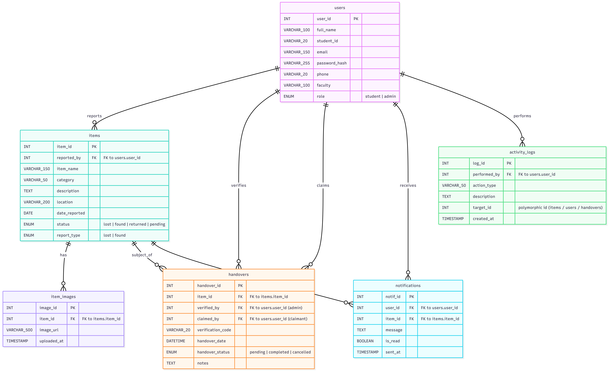

E-Lost: Campus Lost & Found Ledger

A community-driven system to report and recover lost items within the university premises.

CRUD: Students report lost items or post "Found" notices; security admins manage the handover and verification.

Dashboard: Return rate success percentage and categories of most frequently lost items.
URL:
https://nasrixz.github.io/E-Lost-Campus-Lost-Found-Ledger/storyboard/01_login.html

ERD:

